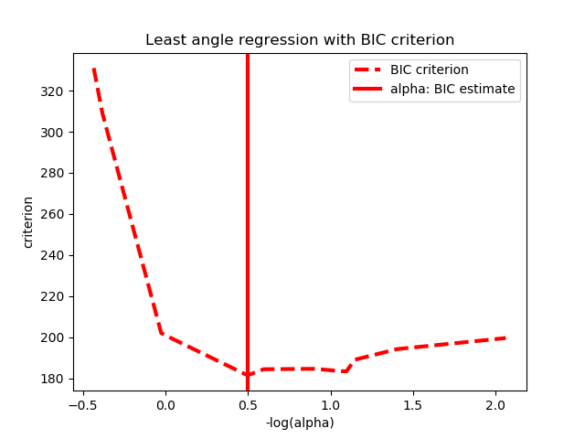
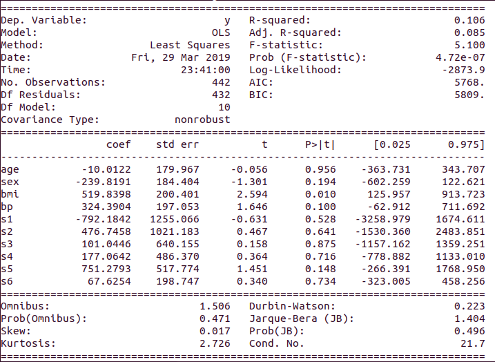

# cebd1160_project_template
Instructions and template for final projects.

| Name | Date |
|:-------|:---------------|
|Rafael Badillo-Gomez | March 29, 2019|

-----

### Resources
Your repository should include the following:

- Python script for your analysis: `diabetes.py`
- Results figure/saved file `files_figures/`
- Dockerfile for your experiment: `Dockerfile`
- runtime-instructions in a file named RUNME.md

-----

## Research Question

Examine the effectiveness of applying several machine learning methods to examine diabetes disease progression. using data colleced from 442 patients.

### Abstract

Using data collected from 442 patients, specifically we will examine if age, sex, body mass index, average blood pressure, and six blood serum measurements are useful in explaining progression in a quantitative measure of disease progression one year after a baseline measurement.

As mentioned in the question, we will be using different machine learning methdos and verify their results. We will see the perfomance of a Linear regression model compared to a Ridge regression and a Lasso model. In the end we did see a difference in the Mean Square error but oddly enough all resulted with the same R2 score.

### Introduction

The data comes from [Efron et al. (2003)](http://web.stanford.edu/~hastie/Papers/LARS/LeastAngle_2002.pdf). Based on the [Scikit-Learn Dataset](https://scikit-learn.org/stable/datasets/index.html#diabetes-dataset), note that the 10 x variables have been standardized to have mean 0 and squared length = 1 (sum(x^2)=1).

### Methods

The main goal was to try and replicate the analysis done from the [Modeling Diabetes Progression](http://rstudio-pubs-static.s3.amazonaws.com/179696_4ec63b7308fb45238f7e3aad1abffd76.html) by Tobia Martens. Using similar methods all through Python compared to R.

### Results

Initial summary through an OLS Regression Results:

Following the results from the 3 models tested.

Linear regression
`Coefficients:`
 `[[ -43.26774487 -208.67053951  593.39797213  302.89814903 -560.27689824`
   `261.47657106   -8.83343952  135.93715156  703.22658427   28.34844354]]`
`Mean squared error: 3180.20`
`Variance score: 0.36`

Ridge regression
`Coefficients:` 
 `[[  21.19927911  -60.47711393  302.87575204  179.41206395    8.90911449`
   `-28.8080548  -149.30722541  112.67185758  250.53760873   99.57749017]]`
`Mean squared error: 3192.33`
`Variance score: 0.36`

Lasso model
`Coefficients:` 
 `[  -0.         -129.78400011  592.20328049  240.12404875  -41.64058526`
  `-47.62797321 -219.10436344    0.          507.36252305    0.        ]`
`Mean squared error: 3202.04`
`Variance score: 0.36`

As mentioned above, you will notice that all result with the same Variance or R2 score and from my understanding it seems the Linear Regression model performed best with the lower Mean squared error score.

### Discussion

The results seem to have the opposite effect from where I was trying to replicate. This would mean that I would have to continue to work with the data in order to get something closer to that analysis.

### References
Links are shown on the text from where the information was obtained.

-------
